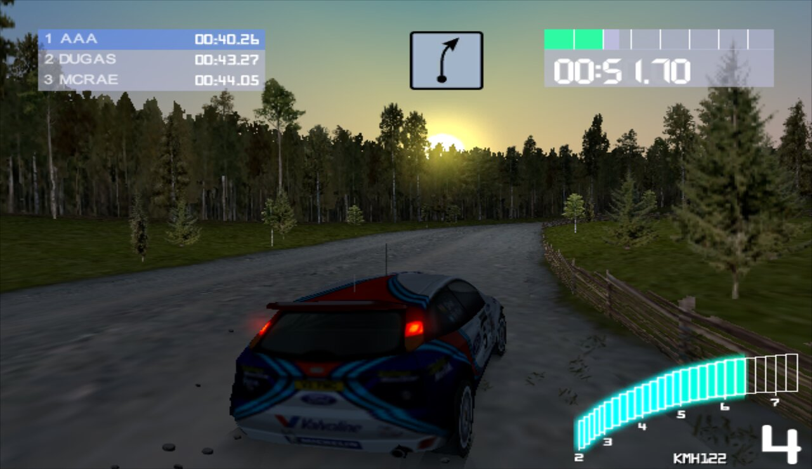
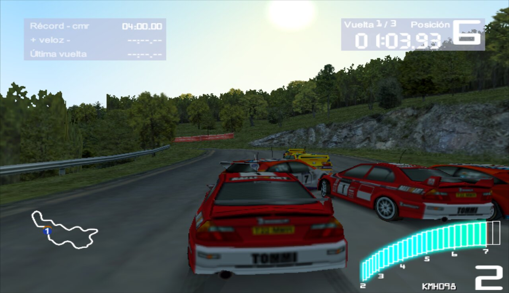
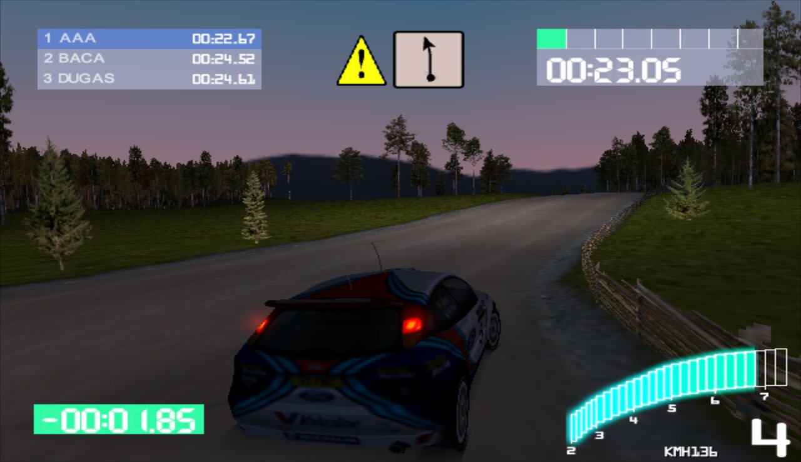
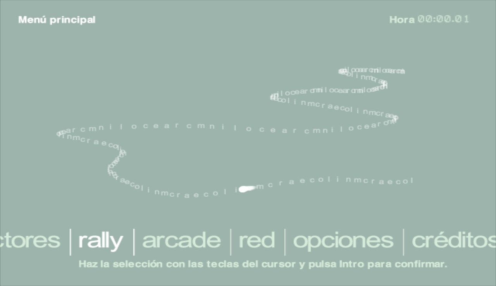

# CMR2Decomp

[](https://github.com/pablocpas/CMR2Decomp/actions/workflows/build-and-report.yml)
[](https://decomp.dev/pablocpas/CMR2Decomp)

A matching decompilation of **Colin McRae Rally 2.0** for PC (Win32), rebuilt
with Microsoft Visual C++ 6.0 and checked against the original executable with
[reccmp](https://github.com/isledecomp/reccmp). The reference SHA-256 is
recorded in `reccmp-project.yml`.

> [!NOTE]
> **This project is heavily AI-assisted.** Most of the decompiled source,
> tooling and documentation was written by AI coding agents (Anthropic's Claude
> and OpenAI's Codex) under human direction. Correctness rests on automated
> checks, not on manual review of every line: each function is compared
> byte-for-byte against the original executable, and differential tests run
> original and rebuilt code side by side. Names, types and comments are
> best-effort reconstructions and may be wrong.

All 3364 game functions identified in the executable have C++ source. Most
compile to byte-identical code; the rest still differ from the original, mostly
in instruction scheduling and register allocation. Live progress, counted as
the share of code bytes that match exactly, is on
[decomp.dev](https://decomp.dev/pablocpas/CMR2Decomp).

<p align="center">
  
  
  
  
</p>
<p align="center"><sub>The rebuilt executable running under Wine on Linux.</sub></p>

## Status

The rebuilt executable is playable for the most part: it boots, runs the menus
and drives rallies on top of the original game data. There are still bugs and
some behaviour that needs fixing, so expect rough edges.

## Goals

1. **Finish matching** the remaining functions against the original executable.
2. **Port to SDL3**, replacing DirectDraw/Direct3D 7, DirectInput and the
   Windows-only audio and window code with SDL3 and the SDL GPU API (Vulkan,
   Direct3D 12 and Metal), so the game runs natively on modern Windows, Linux
   and macOS.
3. **Modernise it while preserving it**: widescreen and arbitrary resolutions,
   modern controller support, an updated renderer with better lighting and
   image quality, and quality-of-life improvements. Every upgrade stays
   optional, and the original look and behaviour remain one toggle away.

## Layout

| Path | Contents |
| --- | --- |
| `CMR2Decomp/` | Game source. Each function carries a `// FUNCTION: CMR2 0x...` annotation with its original address. |
| `third_party/` | DirectX 7 and Bink SDK headers and import libraries (submodules). |
| `scripts/` | Build, measurement and matching tools. `functions.tsv` is the original function inventory. |
| `tests/` | Differential harnesses that run original and rebuilt machine code side by side. |
| `CMR2PROGRESS/` | Measurement data for the current source: scores, byte audit, symbol map. |

## Build

Initialize the SDK submodules and provide MSVC6 (`msvc600/VC98`), for example
from [itsmattkc/msvc600](https://github.com/itsmattkc/msvc600). The original
executable was built with the **Visual C++ 6.0 SP3** compiler (its Rich header
records build 8447), so install the SP3 compiler passes on top; this needs
7-Zip or `cabextract`:

```bash
python3 scripts/fetch_vc6sp3.py --msvc-root msvc600/VC98
```

Windows:

```bat
python scripts/build.py --msvc-root msvc600/VC98
```

Linux, with Wine:

```bash
export CMR2_MSVC_ROOT=/path/to/msvc600/VC98
python3 scripts/build.py
```

The build compiles with `/O2 /DNDEBUG /D_CRTIMP= /Zi /Gz /MD /GX`, adds
`/QIfist` to the translation units that need it and `/Ob2` to zlib, and records
source, compiler, EXE and PDB hashes in `build/manifest.json`.

`--windowed` enables windowed rendering support for running the game under
Wine. Always measure the default build.

## Measure

Place the original `CMR2.exe` in `cmr2bin/`, create the local
`reccmp-user.yml` / `reccmp-build.yml` with `reccmp-project detect`, then:

```bash
python3 -m pip install -r scripts/requirements.txt
python3 scripts/measure.py
```

This checks that sources and binaries match the build manifest, verifies
annotations and global data, writes `index.html`, and updates `CMR2PROGRESS/`:

- `summary.json`: reccmp function scores.
- `bytes.json`: byte-exact audit of every annotated function after relocation.
- `entities.json`: the symbol map of this build.
- `nonmatching.tsv`: remaining non-exact functions, lowest score first.
- `provenance.json`: counts, build inputs, hashes and unresolved symbols.

The byte audit is the authoritative metric: reccmp occasionally scores a
byte-identical function below 100% when an operand resolves to a neighbouring
symbol. Exactness includes embedded switch tables. Progress is reported as two
size-weighted percentages (also in the decomp.dev report): perfect match, the
code bytes of byte-exact functions, and fuzzy match, the similarity of every
function with register names and branch targets ignored (`fz` in bytes.json).

After measuring, run `python3 scripts/prepare_fastcmp.py` to refresh the
metadata used by `scripts/fastcmp.py`, the single-function comparator.

On Linux, `scripts/setup_linux.sh` does all of the above in one go (Wine,
MSVC6 + SP3 next to the repository, the original executable, reccmp, a first
build and measurement).

### Matching loop

```bash
python3 scripts/match.py --list --shape   # remaining functions, register-only diffs first
python3 scripts/match.py 0x4a5e40         # compile its TU, diff it, check the whole TU (~1 s)
python3 scripts/match.py --changed        # every TU edited since HEAD; exit 1 on any regression
python3 scripts/helper_hints.py           # where FixedPoint.h helper usage differs from the original
```

`CLAUDE.md` describes the workflow and the fixes that have worked so far.

- `scripts/rename_search.py 0xADDR [--apply]`: MSVC6 breaks ties between equally used stack slots by variable name; this tries semantics-preserving renames of the function's locals.

## Differential tests

The harnesses in `tests/` execute original and rebuilt code under Unicorn with
the same inputs and compare memory, guards and relevant calls. After building
and measuring, with the same compiler/Wine environment:

```bash
export CMR2_TOOLS=/path/to/directory-containing-msvc600
python3 tests/run_differential_suite.py --jobs 3
```

See [tests/README.md](tests/README.md) for details.

## Contributing

- Keep each `FUNCTION` / `GLOBAL` address annotation; it is the function's
  stable identity.
- Use descriptive names once callers and behaviour establish the role
  (`Subsystem_Action` for free functions, the existing class style for
  methods). Unknown fields stay `field_0x...`. Recovered names describe
  behaviour; they are not claimed to be the original developers' names.
  `scripts/rename_functions.py` renames in validated batches (see its
  `--help`); `scripts/renames/` keeps the applied maps with their evidence.
- Preserve types, struct offsets, declaration order and expression order when
  renaming. Build, measure and run the differential suite for each batch, and
  check that no exact function or score regresses.
- `scripts/permute_batch.py` searches source variants for non-exact functions
  on an isolated snapshot and writes a reviewable patch; see its `--help`.

## Credits

This project builds on [CMR2Decomp/CMR2Decomp](https://github.com/CMR2Decomp/CMR2Decomp),
started by Matt Hadden ([@Forceh91](https://github.com/Forceh91)), who set up
the original source tree, the reccmp configuration and the CI this repository
still uses.

## License

GPL-3.0; see [LICENSE](LICENSE). You need your own copy of the game.
