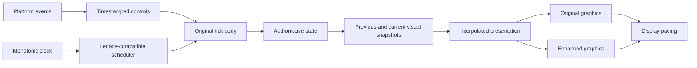

# Modern rendering with the original simulation

Design based on the current source, 2026-10-09. The initial M0 stage capture,
recorded-input playback and CPU profiling are implemented; see
[BASELINE.md](BASELINE.md) for commands, measured results and coverage limits.
The remaining interfaces and migration steps are proposed work. Complete
race-level equivalence and display pacing have not yet been established.
The detected numeric differences are corrected: 500 Finland stage 1 updates
match original + SilentPatch at six cadences. Mixed-precision duplicate steps
and a frame-dependent extra countdown step are fixed in the port; see
[PHYSICS_PARITY.md](PHYSICS_PARITY.md). Broader fidelity remains to be tested.

## Decision

Keep the original vehicle update frequency, fixed-point arithmetic, constants,
pass order, collision rules and replay semantics. Modernise presentation through
the existing interpolation and renderer interface. Start with one CPU thread;
introduce threading only if profiling identifies a need and state ownership is
already explicit.

There are two separate requirements:

- **Simulation fidelity:** the same initial conditions and tick-indexed inputs
  produce the same authoritative state at each simulation tick.
- **Presentation quality:** render at the display cadence with stable pacing,
  consistent camera/vehicle motion and optional modern lighting.

The first is a testable acceptance criterion, not a guarantee established by
the current build. Matching the current port and matching the original
executable are separate checks.

## What the game already does

| Source | Observed behaviour | Consequence |
| --- | --- | --- |
| `game/Car.cpp`, car initialisation (`CARF(0xa98)`) | Stores the float bits for 25 Hz. | Normal local cars already have a simulation frequency independent of display FPS. |
| `Car_UpdateEngineNoteFalloff` in `game/Car.cpp` | Despite its name, computes elapsed-time tick counts and the fractional presentation phase; caps pending steps at five. | This is the scheduling seam. Preserve its behaviour as the reference before refactoring. |
| `Race_UpdatePlayerViewAndDrivenCars` in `game/Race.cpp` | Runs pending steps, reads controls, updates cars and replays, decrements each car's step count, then prepares interpolated visuals. | The existing tick body is larger than the vehicle integrator. |
| `Physics_SetScale` and `StageTiming_LoadStageCarsAndEffects` | Initialise the car physics scale and reciprocal from 25 in 16.16 format. | Physics values are normalised to the original step; passing 0.04 directly to these helpers would change units. Preserve the exact fixed-point results. |
| `Car_StoreRenderTransforms` / `Car_InterpolateRenderTransforms` | Keep two poses and interpolate the body and wheel records. | Reuse the existing pair and phase; avoid interpolating an already interpolated pose again. |
| `Race_UpdateFrameEffects` / `View_BlendCameraStates` | Interpolate objects, particles, dash effects and camera states. | Smooth presentation is already partly implemented. |
| `Replay_AdvanceLiveRecordingStreams` / `Replay_RecordPeriodicCarSamples` | Gate recording on pending car steps; pose samples have a three-step cadence. | Preserve the original replay time base. Recorded pose playback alone cannot prove physics fidelity. |
| `Replay_RestoreCarState` | Can restore a different frequency for certain ghost records. | Treat 25 Hz as the normal local-car rate, not a universal replacement for every stored rate. |

Increasing display FPS should not increase the normal local-car tick count.
Increasing the car frequency itself requires changing simulation semantics and
is outside this design's fidelity goal.

## Boundaries to establish

The renderer consumes presentation data. Added render passes cannot advance
AI, replay lanes, input filters, physics, gameplay timers or the gameplay RNG.
Changing a graphics preset only selects a rendering path and invalidates visual
history when needed.

### Simulation and clocks

Initially keep the existing scheduler and clock sampling points, including its
millisecond arithmetic and floating-point conversions, behind a small adapter.
The current code samples frame time before presentation and updates statistics
in the scene drawing path. Moving either operation can change tick boundaries
or effect timing; capture their baseline behaviour first.

Once the boundary is validated, use a 64-bit monotonic host clock and integer
tick accounting for the normal 40 ms interval. Retain a legacy clock view for
code that expects milliseconds or centiseconds. Record which tick owns an
event, rather than deriving gameplay time from the number of rendered frames.
Verify pause, focus changes, stage restart, loading and long sessions.

Keep host time, simulation tick time and presentation time explicit. A new
high-resolution presentation phase may improve smoothness without changing
the authoritative tick sequence, but still requires checking camera, replay
and pose-pair selection. Nanosecond units do not imply nanosecond timer accuracy.

Overload behaviour is part of compatibility: the current five-step cap can
discard elapsed steps. Keep that behaviour available as the reference. A new
policy may retain simulation debt and skip presentation while catching up;
it must be tested and documented separately. Avoid increasing the physics step
to consume a stall. Pause/resume rebases host time rather than integrating time
spent inactive.

### Inputs

Poll platform events frequently and buffer their time/order. In the reference
path retain the existing control processing and sampling semantics. For the
decoupled path, construct one control record per simulation tick, preserving
axis ranges, dead zones, response filters and button-edge handling.

Do not assign the latest input sample to every past tick after a stall. Define
tick-boundary inclusion once, including events exactly on a boundary. Record
the resolved controls after the legacy mapping so regression playback is
independent of hardware and render cadence. Keep a separate raw event trace
to test the mapping and live-input latency.

### Authoritative state and presentation

Use sidecar visual snapshots keyed by stable object identities/generations.
Keep original game structures and on-disk records compatible. Snapshots contain
body/wheel poses, visual suspension data, camera states and visual attachment
data; a shallow copy of `Car` is insufficient because it contains shared pointers.

Classify fields and node readers before moving writes: camera blending currently
writes into shared car scene nodes. The existing render transforms are also used
by view-dependent car code. A field is presentation-only only after confirming
it cannot influence a subsequent authoritative tick.

Initially use the existing matrix interpolation for the original path. Improved
rotation interpolation can be introduced in the enhanced path after testing
wheel wrap, camera cuts and attachment consistency. Interpolation adds up to
one simulation interval of presentation delay; measure end-to-end latency and
avoid adding another snapshot interval or an unnecessary GPU queue.

Stage load, reset, teleport, ghost restart and identity reuse invalidate pose
history. Initialise both snapshots to the new pose to avoid blending through
the map. Split-screen views share a simulation but keep separate visual history.

## Hidden coupling to audit

| Coupling in the current source | Implementation requirement |
| --- | --- |
| `src/platform/msvcrt.cpp` keeps a global MSVC RNG; game effects also call `rand`. | Preserve the legacy random-call sequence. Added visual noise uses a separate renderer RNG. Audit existing frame-dependent calls before claiming cadence independence. |
| Camera blending modifies shared scene nodes; view-dependent car routines read render transforms. | Identify readers, keep simulation nodes authoritative, and expose derived poses through an adapter. State hashes before/after presentation must cover all fields that physics can later read. |
| `CGame::AdvanceCallbackStateTimers` increments counters per callback frame. | Classify each counter's intended time base. Preserve gameplay tick semantics; convert only proven presentation counters. |
| `Graphics_UpdateFrameStatistics` runs during scene drawing and divides by millisecond frame duration. | Maintain timing when using a null renderer; handle zero-duration frames in a reviewed change after baseline capture. |
| `Physics_UpdateRateHold` changes a separate stage-object scale from render FPS. | Audit moving-object collision, debris and damage readers; distinguish visual effects from authoritative moving objects. |
| Replay/ghost code has input lanes, state lanes, pose interpolation and stored rates. | Validate each kind independently, preserving tick counts, sample cadence and event order. |
| GPU readback currently waits for a fence for the lens-flare test. | Measure the stall; use delayed readback if visual behaviour allows it, with frame/view tagging. Keep CPU readback results out of new gameplay logic. |

These are observed interfaces and risks to investigate, not proof that every
listed path currently changes the vehicle result with FPS.

## Renderer implementation

Keep `src/port/gfx.h` as the compatibility boundary. Extend the frame recording
and executor incrementally, adding sidecar metadata only where needed:

- A stable object identity, view identity, material identity and pass role.
- Current and previous **presented** transforms for motion vectors; these differ
  from the two simulation snapshots used to build an interpolated pose.
- Explicit world/UI classification. Pre-transformed vertices also represent
  world sprites and effects, so `GfxCommand::transformed` cannot identify HUD alone.
- Frame resources: linear HDR colour, sampleable depth, normals, optional material
  properties and motion, with per-view histories and explicit lifetimes.

Forward rendering with auxiliary buffers is a sufficient starting point for
these effects; a full deferred renderer is not a prerequisite. Keep transparent
draw order and the original path available. Build presentation before executing
the original or enhanced path, so Ctrl+G does not run the game twice. A same-frame
side-by-side comparison may draw both paths from that prepared data.

For shadows and cubemaps, collect visibility from the light/probe as well as the
main camera: replaying only main-view draws misses off-screen casters and reflected
objects. Added collection passes must be read-only and must not consume legacy RNG.

PBR material overrides belong in external/sidecar data. Preserve original texture
and mesh identity, account for lighting already painted into textures, and use
the original track palette, sky, weather and fog as the art reference.

Implement in dependency order:

1. Original/enhanced selection, view metadata, independent internal/output
   resolution, anisotropy and a postprocess stage for FXAA/CAS.
2. Linear HDR lighting, exposure, bloom, tone mapping and supported HDR output.
3. Per-pixel materials and lights, dynamic headlights, environment reflections
   and sun/headlight shadow passes.
4. Auxiliary depth/normal buffers and AO/contact shadows. Establish object identity,
   previous presented poses and history rejection before temporal variants.
5. Temporal AA/reconstruction, temporal AO, SSR, SSGI and volumetrics, measuring
   quality and cost per feature. Handle transparency and responsive masks.

FSR temporal, DLSS and XeSS require separate backend integrations and capability
checks. Validate access to native resources and SDK platform/architecture support
early, before committing to those features. Render cadence must not trigger extra
simulation updates. GPU-generated frames, if ever added, are presentation only.

## Migration and acceptance

| Stage | Concrete deliverable | Acceptance |
| --- | --- | --- |
| M0: capture baseline | Tick-indexed input/state trace, fake-clock playback, timing counters; retain legacy execution as the reference. | Repeatable port traces; separately capture and compare the identified original executable/data version. Report first differing tick and field. |
| M1: expose existing boundaries | Wrap scheduler, tick work and presentation work with the same call order; add immutable visual snapshots and state ownership assertions. | Same reference trace at the same clock/input sequence; measured extra presentation work does not modify authoritative state or gameplay RNG. |
| M2: decouple cadence | Host-clock adapter, input queue and replay clock; render independently and reuse existing interpolation. | Same tick-indexed controls produce identical authoritative traces at 30/60/120/144/240 FPS and variable cadence, with pause/stall policies explicitly tested. |
| M3: modern graphics | Shared presentation data, original/enhanced paths, incremental passes and Ctrl+G. | Switching mode, resolution, VSync or effect settings produces the same authoritative trace. |
| M4: expand coverage | Ghosts, all replay types, multiple cars, split screen, moving obstacles and long sessions. | Cross-rate traces and compatibility fixtures pass; camera/visual history discontinuities and latency are checked. |

Trace canonical fields that determine future ticks: car pose/velocity, contacts,
suspension, drivetrain, controls/filter state, damage, relevant AI/route/timing
state, replay counters, moving collision objects and RNG state. Serialize fields
explicitly; raw structure bytes include pointer values and padding. Compare
floating-point fields by their bits when exact equivalence is required. A hash
is useful for indexing differences, but keep field-level diagnostics.

Exercise acceleration, braking, steering, jumps, landings, collisions, reverse,
reset, finish triggers, focus changes, resizing and render stalls. Scheduler
fixtures additionally cover zero elapsed time, multiple ticks, the five-step
cap and legacy millisecond wrap. Added full-tick tests complement the existing
fixed-point helper test.

In a fake-clock run, rendering rate is a test parameter rather than a live
wall-clock dependency. Interleave extra presentation work between the same
tick inputs and check for feedback. Null execution of recorded GPU commands is
useful, but it still runs game-side drawing; a complete simulation harness needs
input/clock control and a way to avoid GPU creation and timing dependence.

Profile tick cost, CPU preparation, GPU passes, swapchain waits/readbacks,
presentation intervals and input-to-display latency. Check traces and visual
motion separately: stable average FPS alone does not demonstrate smoothness.

## References

- [Glenn Fiedler: Fix Your Timestep!](https://gafferongames.com/post/fix_your_timestep/)
  explains fixed-step simulation, catch-up and interpolation. Its generic loop
  is a design reference; port fidelity requires retaining CMR2's exact semantics.
- [SDL_GetTicksNS](https://wiki.libsdl.org/SDL3/SDL_GetTicksNS) provides a 64-bit
  clock in nanosecond units for host/presentation timing.
- [SDL_WaitAndAcquireGPUSwapchainTexture](https://wiki.libsdl.org/SDL3/SDL_WaitAndAcquireGPUSwapchainTexture)
  documents blocking acquisition and window-thread ownership, relevant to pacing
  and any later threading decision.
- [AMD FSR temporal integration](https://gpuopen.com/manuals/fidelityfx_sdk/techniques/super-resolution-temporal/)
  specifies depth, motion, jitter and reactive-mask requirements for reconstruction.
